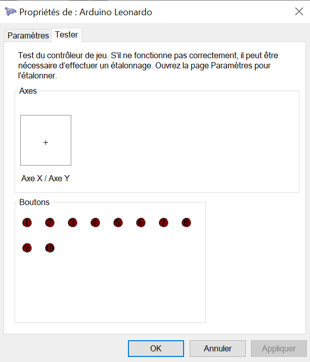

# Basic IMU Joystick
Game controller, based on the MPU6050 gyroscope & Arduino Pro Micro.
See https://github.com/SimonMaier/MarioKartHelmet form more infos.

For the Giant Joystick use the Branch `GiantJoystick` : https://github.com/HackerLoop/BasicHeadTracker/tree/GiantJoystick

## Usage
Plug the USB directly on the computer. (avoid USB Hub).

### On Windows 10
1. Go to  `Settings` -> `Devices`
2. `Devices and Printers` inside the `Printers and Scanners` tab
3. Right click on the controller -> `Game controller settings`

4. click on the `Properties` button

### Joystick to key Mapping
1. Download AntiMicro Software
https://github.com/AntiMicro/antimicro/releases

2. Set the Axis 2 to UP | DOWN key
or see [this example profil](assets/joystick2updown.joystick.amgp)

## Build

### Important
- Keep wire short Between MPU and Arduino (may cause issue if wire are to long)
- Avoid hub USB

### Arduino IDE

1. Install external Arduino libraries:
  - [i2cdevlib](https://github.com/jrowberg/i2cdevlib) collection (at least [I2Cdev](https://github.com/jrowberg/i2cdevlib/tree/master/Arduino/I2Cdev) and [MPU6050](https://github.com/jrowberg/i2cdevlib/tree/master/Arduino/MPU6050)).

    Follow the [installation instructions on the website](https://www.i2cdevlib.com/usage), or copy the folders `i2cdevlib/Arduino/I2Cdev` and `i2cdevlib/Arduino/MPU6050` from the project repository into your Arduino [libraries directory](https://www.arduino.cc/en/hacking/libraries) (`~/Arduino/libraries/` on Linux).

  - [ArduinoJoystickLibrary (>=2.0)](https://github.com/MHeironimus/ArduinoJoystickLibrary)

    Copy the folder `ArduinoJoystickLibrary/Joystick` to your Arduino libraries directory.

2. Upload the software (select Arduino Leonardo as a target board)